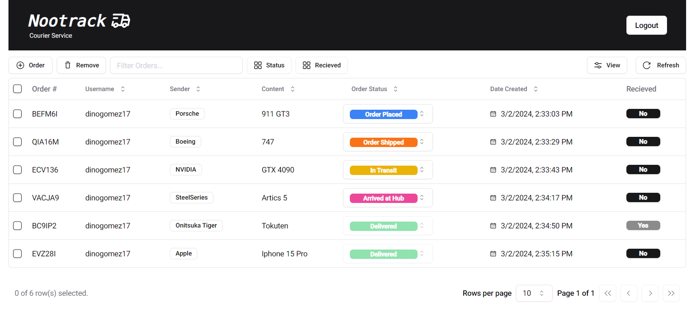

## Noovid: Delivery

A simple NextJS 14 application that uses shadcn/ui, supabase. It tackles topics like revalidation, middleware and session based auth using iron-session.

Create orders in the Courier view.

View and recieve orders in the User view.

